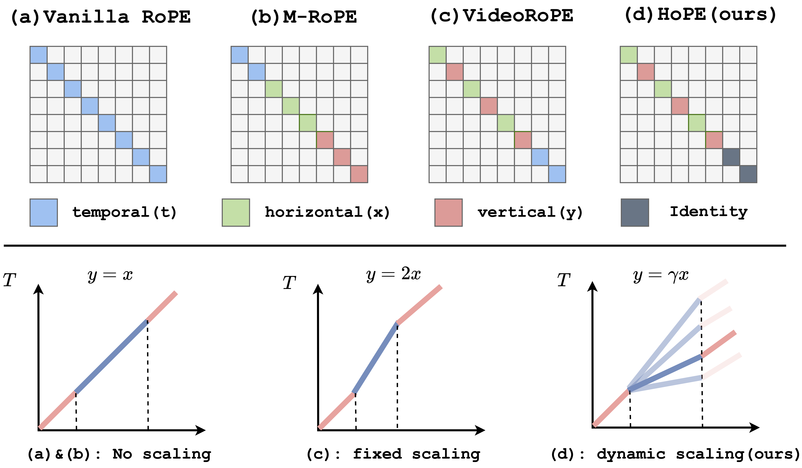

<div align="center">
  
</div>

<h2 align="center" style="font-size: 30px;">HoPE: Hybrid of Position Embedding for Length Generalization in Vision-Language Models</h2>

<h5 align="center">
  
[](https://arxiv.org/abs/2505.20444) 
[](https://huggingface.co/papers/2505.20444)
[](https://github.com/hrlics/HoPE)

</h5>


## 📢 News
- **\[06/29/2025\]** Our work is covered by [JIQIZHIXIN (机器之心)](https://mp.weixin.qq.com/s/KQHGw8_v0rEY8pS7jufRbQ)!
- **\[05/26/2025\]** Release our paper on [arXiv](https://arxiv.org/abs/2505.20444).


## 🔭 Overview

Extending RoPE to multimodal scenarios typically involves allocating different frequencies to encode different positional components (*t*, *x*, *y*). In this paper:

1️⃣ We first investigate **how different frequency allocation strategies impact the semantic modeling capabilities of VLMs**. Our analysis reveals that current multimodal RoPEs, which keep all frequencies, are unreliable in long-term semantic modeling. HoPE tackles this issue by **Hybrid Frequency Allocation (HFA)**, which integrates *zero frequencies* for reliable semantic modeling over extended contexts. 

2️⃣ Moreover, we point out that existing temporal index scaling of visual tokens lacks flexibility and robustness during inference, where videos exhibit varying speeds and information densities. To address this, HoPE introduces **Dynamic Temporal Scaling (DTS)**, which enables VLMs to learn multi-scale temporal relationships during training and adaptively select temporal scaling during inference.

<div align="center">
  
</div>


## 🛠️ Requirements
1. Clone this repository and install `transformers==4.45.2` from source
```
git clone https://github.com/hrlics/HoPE.git
cd HoPE/LLaMA-Factory
wget https://github.com/huggingface/transformers/archive/refs/tags/v4.45.2.tar.gz
tar -xzf v4.45.2.tar.gz
```

2. Install required packages
```
bash setup_env.sh
```

3. Replace the code in
```
HoPE/LLaMA-Factory/transformers-4.45.2/src/transformers/models/qwen2_vl/modeling_qwen2_vl.py
```
with `HoPE/modeling_hope.py`. The differences are marked with `# MODIFIED`.


## 🚀 Train
Under `LLaMA-Factory/`, run the following script to start training:
```
train_hope.sh
```


## :clipboard: Todo
- [x] Release [paper](https://arxiv.org/abs/2505.20444) on arXiv
- [ ] Release training code. Stay tuned! 


## 📖 Citation
If you find our work helpful, please consider citing 📝 and giving us a star ⭐
```
@article{li2025hope,
  title={HoPE: Hybrid of Position Embedding for Length Generalization in Vision-Language Models},
  author={Li, Haoran and Qin, Yingjie and Ou, Baoyuan and Xu, Lai and Xu, Ruiwen},
  journal={arXiv preprint arXiv:2505.20444},
  year={2025}
}
```

## 🙏 Acknowledgements
We thank the authors of [Qwen2-VL](https://github.com/QwenLM/Qwen2.5-VL), [VideoRoPE](https://github.com/Wiselnn570/VideoRoPE), [transformers](https://github.com/huggingface/transformers), [LLaMA-Factory](https://github.com/hiyouga/LLaMA-Factory), and [vLLM](https://github.com/vllm-project/vllm) for their wonderful work.
